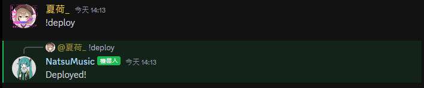
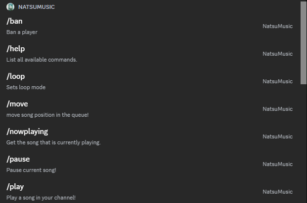
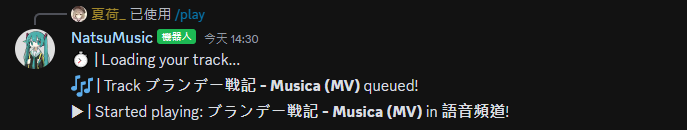

# NatsuMusic
A simple discord bot that helps you manage your server by providing useful commands like playing music or deleting text messages.

### Starting the application

```bash
node index.js
```

### Deploying commands

Before you can use the bots slash command you first need to add them to your Discord server. You can use the `!deploy` command to do so.



After deploying the commands you should be able to see and access them by typing a slash:



## Features & Commands

> Note: The repository now uses the new Discord slash commands

* [Play](#play)
* [Pause](#pause)
* [Resume](#resume)
* [Now Playing](#now-playing)
* [Queue](#queue)
* [Shuffle](#shuffle)
* [Loop](#loop)
* [Skip](#skip)
* [Remove](#remove)
* [Move](#move)
* [Swap](#swap)
* [Stop](#stop)
* [Volume](#volume)
* [Help](#help)
* [Userinfo](#userinfo)
* [Ban](#ban)
* [Purge](#purge)

### Play

▶️ Play music from YouTube via url or search by song name, added to the bottom of the queue.

`/play YOUTUBE_URL`  
`/play SONG_NAME`

▶️ Play music via url or using song name, this places it next at the top of the queue (position 1).

`/playtop YOUTUBE_URL`  
`/playtop SONG_NAME`



### Pause

⏸️ Pause music

`/pause`

### Resume

▶️ Resume playing paused music

`/resume`

### Now Playing

🎶 Display current playing song

`/nowplaying`

### Queue

🗒️ Display the current queue

`/queue`

### Shuffle

🔀 Shuffle the current queue

`/shuffle`

### Loop

🔁 Loop/Repeat controls. Off, Track and Queue

`/loop MODE`

### Skip

⏭️ Skip the current playing song and play the next in queue

`/skip`

### Remove

⏏ Remove song from the queue

`/remove POSITION`

### Move

↕ Move song position. This shifts all other songs up or down one, depending on direction you move the target song.

`/move TRACK_POSITION TARGET_POSITION`

### Swap

↔️ Swap two songs current positions with each other

`/swap POSITION_1 POSITION_2`

### Stop

🔇 Stop playing (disconnects bot from voice channel)

`/stop`

### Volume

🔊 Adjust the music bot volume between 0-200

`/volume NUMBER`

### Help

❓ Display commands

`/help`

### Userinfo

* Get information about a user (/userinfo USER)

### Ban

* Ban a player (/ban USER)

### Purge

* Delete the latest chat messages (/purge NUM_OF_MESSAGES)
